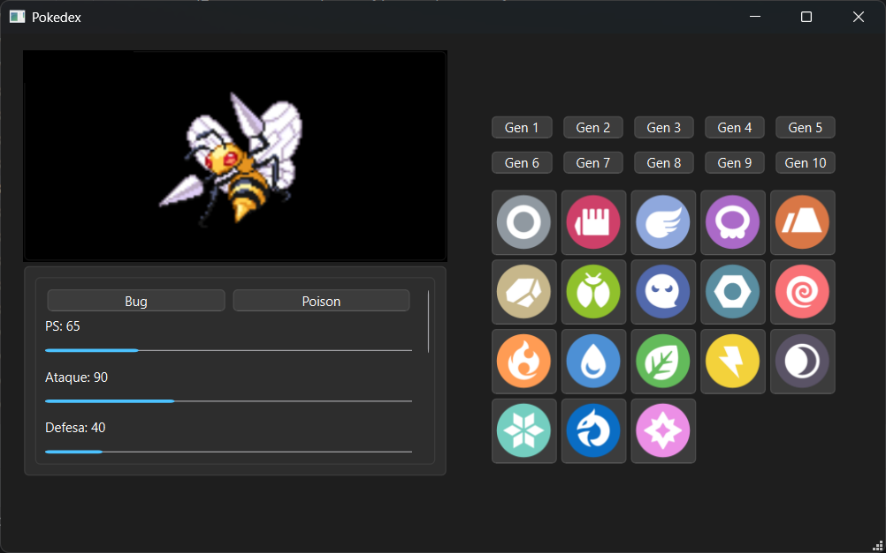

# Pokedex Beta Build v0.1  

Esta é minha Pokedex desenvolvida em Python, com informações sobre todos os Pokemon até a Geração IX.  
Ela possui um filtro para facilitar a busca do Pokémon e traz informações de Nome, Atributos, Tipos, Evoluções e um Descrição.  
  
:construction:  Projeto em construção  :construction:
  
## Funcionalidades  
- Permite utilizar filtros de tipos (até 2 tipos diferentes) e filtrar por geração;  
- Traz informações de batalha, sprites e sprites shiny;
- Em desenvolvimento: Traz informações de Formas Regionais, Mega Evoluções e Formas Gigantamax.  
  
## Como usar  
1. Faça o Download do aplicativo "pokedex.exe" da database "pokemons.db" e das pastas "asset" e "images";  
2. Na tela inicial, aparecerá a lista de todos os pokémon lançados até a Geração IX;  
3. Você já pode escolher seu Pokémon pela lista ou pode aplicar filtros  de tipos para refinar a busca (Filtro por geração em desenvolvimento);  
  
## Interface  
  

## Sobre o Autor  
Desenvolvido por Petérquio - dfmorgs@gmail.com  
LinkedIn - [Diego Morgado](https://www.linkedin.com/in/diego-morgado-145ab912b/])  

:balance_scale: **MIT license**
